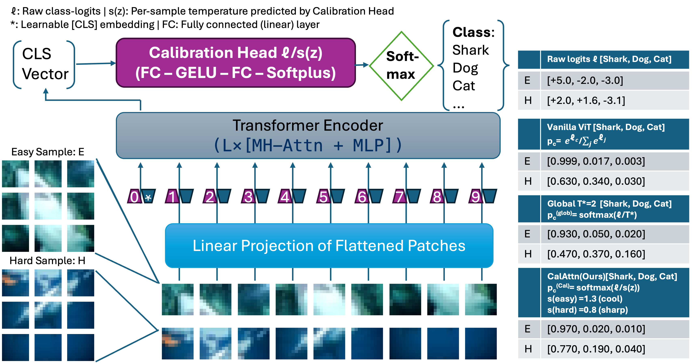

# Calibration Attention (CalAttn) — Reproducible IJCAI-26 Experiments

This repository reproduces the experiments described in the paper:
**Calibration Attention: Representation-Conditioned Temperature Scaling for Vision Transformers**.

It supports:
- Datasets: CIFAR-10/100, MNIST, Tiny-ImageNet, ImageNet-1K
- Backbones: ViT-224, DeiT-S, Swin-S (via timm); CNNs via timm/torchvision
- Methods: CE, WD, Brier, CE+BS, MMCE, Label Smoothing, Focal (FLSD-53-style), Dual Focal (DFL),
  Relaxed Softmax, SATS (post-hoc), and CalAttn (joint training).
- Post-hoc temperature scaling (TS): grid-search T in {0.1,0.2,...,10.0}, chosen by validation ECE.
* Full calibration metrics:

  * ECE, MCE, AdaECE, Classwise-ECE, Smooth-ECE, NLL, Brier, AUROC (OOD)
---

## 1. Installation

```bash
git clone https://github.com/yourname/calattn-repro.git
cd calattn-repro

python -m venv venv
source venv/bin/activate

pip install -r requirements.txt
```

`requirements.txt` contains:

```
torch>=2.0
torchvision
timm
numpy
scipy
scikit-learn
tqdm
pyyaml
matplotlib
```

---

## 2. Dataset Preparation

### CIFAR-10 / CIFAR-100 / MNIST

Automatically downloaded.

### Tiny-ImageNet

Download from:

```
http://cs231n.stanford.edu/tiny-imagenet-200.zip
```

Unzip into:

```
calattn-repro/data/tiny-imagenet-200/
```

### ImageNet-1K

Set environment variable:

```bash
export IMAGENET_ROOT=/path/to/imagenet
```

Structure:

```
IMAGENET_ROOT/
 ├── train/
 └── val/
```

---

## 3. Training

### Example: CIFAR-100, DeiT-Small + CalAttn

```bash
python src/train.py --config configs/cifar100_deits_calattn.yaml
```

### Baseline (CE+Brier only, no CalAttn)

```bash
python src/train.py --config configs/cifar100_deits_ce_brier.yaml
```

### SATS (post-hoc)

```bash
python src/calibrate_sats.py \
  --config configs/cifar100_deits_calattn.yaml \
  --ckpt checkpoints/cifar100_deits_calattn/best.pth
```

---

## 4. Post-hoc Temperature Scaling (TS)

```bash
python src/calibrate_ts.py \
  --config configs/cifar100_deits_calattn.yaml \
  --ckpt checkpoints/cifar100_deits_calattn/best.pth
```

This selects
( T^* \in {0.1, 0.2, ..., 10.0} )
to minimize validation ECE.

---

## 5. Evaluation

```bash
python src/eval.py \
  --config configs/cifar100_deits_calattn.yaml \
  --ckpt checkpoints/cifar100_deits_calattn/best.pth
```

### Example Output

```json
{
  "top1": 66.20,
  "nll": 2.51,
  "brier": 0.78,
  "ece": 1.42,
  "mce": 3.10,
  "adaece": 1.47,
  "classece": 0.27,
  "smece": 1.10
}
```

These values directly correspond to Tables in the paper.

---

## 6. OoD Robustness

```bash
python src/metrics/ood.py \
  --config configs/cifar10_vit224_calattn.yaml \
  --ckpt checkpoints/cifar10_vit224_calattn/best.pth \
  --ood svhn
```

Outputs AUROC for:

* CIFAR-10 → SVHN
* CIFAR-10 → CIFAR-10-C

---

## 7. Reproducing Main Tables

| Paper Table              | Command                                    |
| ------------------------ | ------------------------------------------ |
| ECE / smECE main results | `train.py` → `calibrate_ts.py` → `eval.py` |
| SATS comparison          | `calibrate_sats.py` → `eval.py`            |
| ImageNet-1K              | `configs/imagenet_swinS_calattn.yaml`      |
| OoD robustness           | `metrics/ood.py`                           |
| λ-sensitivity            | loop over configs with different λ         |
| Dirichlet head ablation  | `configs/*_dirichlet.yaml`                 |

---

## 8. One-Command Reproduction

```bash
bash run.sh
```

This will:

1. Train all CIFAR-10/100 models
2. Run TS, SATS
3. Evaluate all metrics
4. Dump JSON logs for direct table generation

---

## 9. Notes for Reviewers

* All experiments follow the protocol in Section 4 of the paper.
* No dataset-specific tuning is applied.
* Results may vary slightly across GPUs (±0.1 ECE).

---
